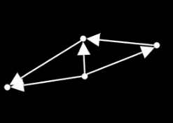
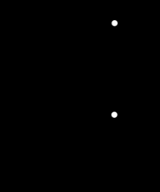

# [graph](https://docs.manim.community/en/stable/reference/manim.mobject.graph.html#)

图论相关

- DiGraph：有向图（顶点间通过有向边连接的图结构）

    

- GenericGraph：图的抽象基类（所有图结构的基础父类，定义了顶点与边连接的核心特性）

    ✨基础类, 不直接使用

- Graph：无向图（顶点间通过无向边连接的图结构）

    

- LayoutFunction：自动布局函数协议（用于计算图的布局，供 `change_layout()` 方法调用的规范接口）

