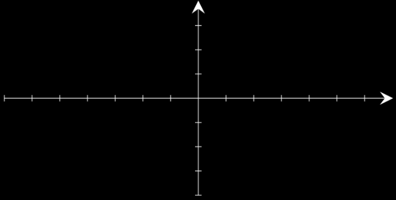
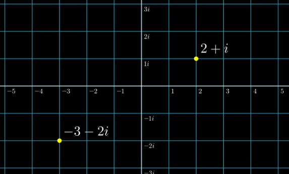
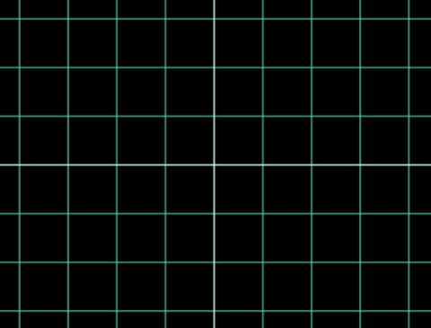
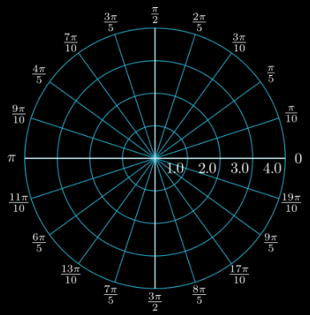
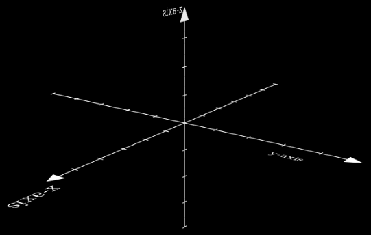
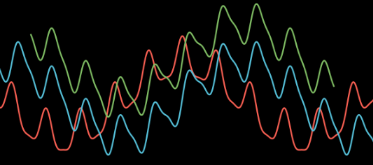
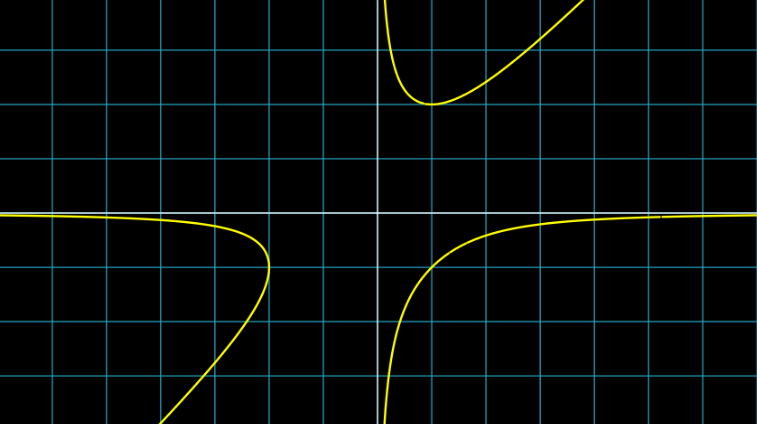
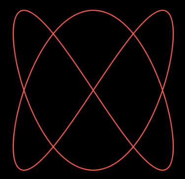
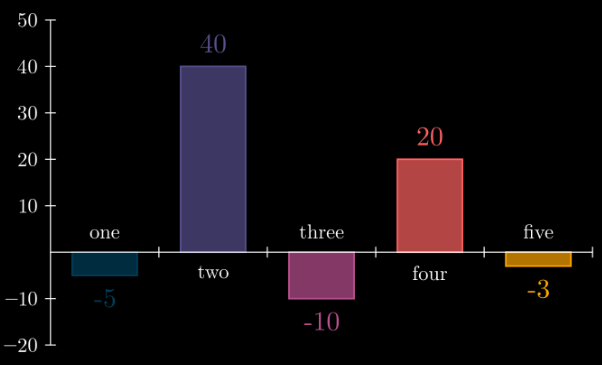

# [graphing](https://docs.manim.community/en/stable/reference/manim.mobject.graphing.html)

- coordinate_systems：表示坐标系的对象集合（Mobjects）

    - Axes：创建一组坐标轴（常用于平面直角坐标系，支持自定义刻度、范围等）

        
    
    - ComplexPlane：专为复数使用设计的数轴平面（NumberPlane 的特例，适配复数可视化场景）

        
    
    - CoordinateSystem：坐标系抽象基类（Axes 和 NumberPlane 的父类，定义坐标系核心特性）
    
        ✨基础类, 不直接使用

    - NumberPlane：创建带背景网格线的笛卡尔平面（即平面直角坐标系，含横纵轴与网格）

        
    
    - PolarPlane：创建带背景网格线的极坐标系平面（以极径、极角为核心的坐标系）

        
    
    - ThreeDAxes：三维坐标轴（支持三维空间的可视化，含 x、y、z 三轴）

        

- functions：表示函数图像的对象集合（Mobjects）

    - FunctionGraph：默认跨越场景长度的参数函数（ParametricFunction 的子类，专门用于绘制普通函数图像，无需手动指定参数范围即可适配场景）

        

    - ImplicitFunction：隐函数（用于绘制隐函数方程对应的图像，如$x^2 + y^2 = r^2$ 这类无法直接解出 $y = f(x)$ 的方程）

        
    
    - ParametricFunction：参数曲线（通过参数方程定义的曲线，如圆的参数方程 $x = r\cos\theta$、$y = r\sin\theta$ 对应的图像）

        

- number_line：表示数轴的对象（Mobject）

    - NumberLine：创建带有刻度标记的数轴（支持自定义范围、刻度间隔、标签等）

        
    
    - UnitInterval：单位区间（表示 [0, 1] 区间的数轴子类，默认范围从 0 到 1，简化单位区间的可视化创建）

- probability：表示概率论与统计学相关对象的集合（Mobjects）

    - BarChart：创建柱状图（支持自定义数据、坐标轴标签、柱体颜色、宽度等，用于数据可视化场景）

        
    
    - SampleSpace：表示二维矩形样本空间的对象（Mobject），常用于概率论可视化，如展示随机试验的所有可能结果集合

- scale：尺度/缩放相关组件（Manim 中常用于坐标系、数轴的刻度设置、比例调整，或对象的缩放控制相关功能）

    - LinearBase：默认缩放类（用于线性尺度的缩放控制，适配线性图表、坐标系等场景）
    - LogBase：对数缩放类（专门用于对数图表或对数函数的缩放控制，适配对数尺度可视化场景）

