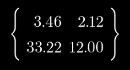
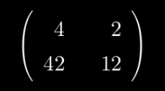
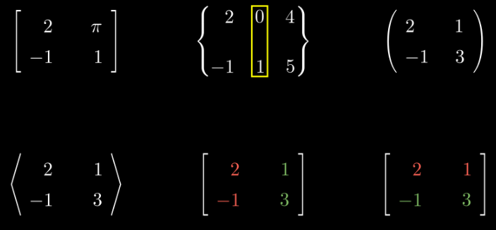
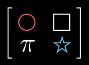

# [matrix](https://docs.manim.community/en/stable/reference/manim.mobject.matrix.html)

- DecimalMatrix：在屏幕上显示元素为小数的矩阵对象（Mobject）

    

- IntegerMatrix：在屏幕上显示元素为整数的矩阵对象（Mobject）

    

- Matrix：在屏幕上显示矩阵的基础对象（Mobject），支持通用矩阵展示

    

- MobjectMatrix：在屏幕上显示以对象（Mobject）为元素的矩阵对象（例如矩阵的每个元素是图形、文本等 Mobject）

    

