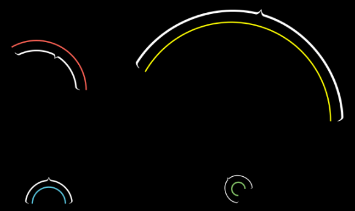
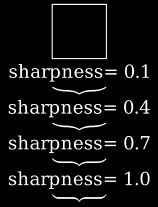
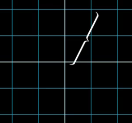

# svg

- brace：表示花括号的对象（Mobject），常用于标注、分组或关联场景（如给公式、图形添加花括号注释）

    - ArcBrace：创建环绕弧形（Arc）的花括号（专门适配弧形对象的花括号标注）

        
    
    - Brace：接收一个对象（mobject），在其相邻位置绘制花括号（通用花括号标注工具）

        
    
    - BraceBetweenPoints：与 Brace 类似，但不依赖对象（mobject），而是通过两个点来定位花括号

        
    
    - BraceLabel：创建带有附加标签的花括号（花括号+文字标签一体化标注）
    
    - BraceText：带文本的花括号（核心用于花括号与关联文本的组合标注，简化文本与花括号的联动使用）

- svg_mobject：从 SVG 文件生成的对象集合（Mobjects），支持导入外部 SVG 图形并在 Manim 场景中使用

    - SVGMobject：通过导入 SVG 文件创建的矢量化对象（VMobject），支持完整导入外部 SVG 图形并保留矢量特性
    
    
    
    - VMobjectFromSVGPath：表示 SVG 路径的矢量化对象（VMobject），专门基于 SVG 文件中的路径信息生成图形

