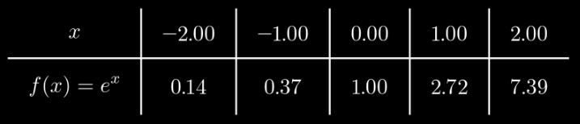
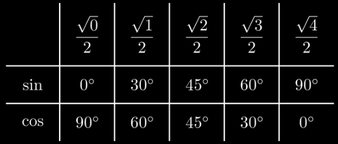
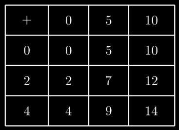

# table

- DecimalTable：专门适配 DecimalNumber 的表格对象（Mobject），用于展示小数类型的表格数据

    

- IntegerTable：专门适配 Integer 的表格对象（Mobject），用于展示整数类型的表格数据

    

- MathTable：专门适配 LaTeX 的表格对象（Mobject），用于展示含数学公式（LaTeX 语法）的表格数据

    

- MobjectTable：专门适配 Mobject 的表格对象（Mobject），用于展示以对象（如图形、文本）为单元格内容的表格

    

- Table：在屏幕上显示表格的基础对象（Mobject），支持通用表格展示，是所有专用表格类的基础

    