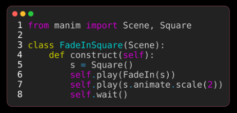
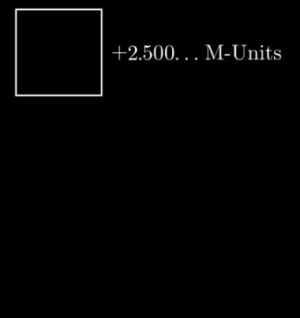
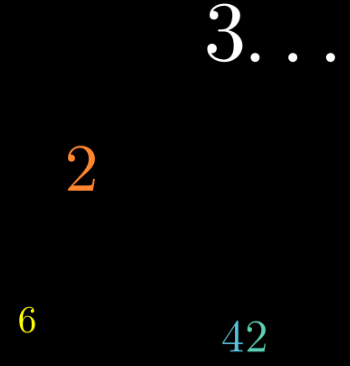
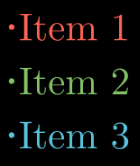
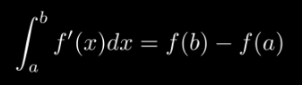
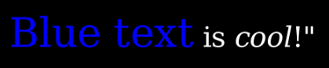
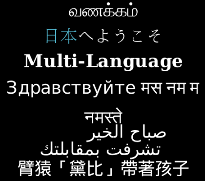

# text

text文字类型, 主要包含4大类对象和11小类对象


- code_mobject：表示带语法高亮的源代码清单的对象（Mobject），用于在场景中展示代码片段

    - Code
        
        


- numbers：表示数字的对象集合（Mobjects），包含各类数字展示相关的专用对象（如整数、小数等）

    - DecimalNumber：表示小数的对象（Mobject），专门用于展示小数形式的数字，支持自定义精度、格式等

        
    
    - Integer：用于展示整数的类，专注于整数类型数字的可视化呈现，适配整数展示场景

        
    
    - Variable：展示“标签=值”格式文本的类，值会通过 ValueTracker 持续更新，适用于动态数值展示

        

- tex_mobject：通过 LaTeX 渲染文本的对象集合（Mobjects），专门用于展示数学公式、复杂排版文本

    - BulletedList：项目符号列表（用于展示带 bullet 标记的列表内容，适配普通文本或简单格式的列表展示）

        
    
    - MathTex：在数学模式下通过 LaTeX 编译的字符串对象（专门用于渲染数学公式、符号，支持 LaTeX 数学语法）

        
    
    - SingleStringMathTex：LaTeX 文本渲染的基础构建块（用于单独渲染单个 LaTeX 数学字符串，是 MathTex 的底层支撑组件）
    - Tex：在普通模式下通过 LaTeX 编译的字符串对象（用于渲染带 LaTeX 格式的普通文本，适配复杂排版的非数学文本）
    - Title：表示带下划线标题的对象（Mobject），专门用于场景标题的展示，自带下划线样式，简化标题排版）

        

- text_mobject：用于展示非 LaTeX 文本的对象集合（Mobjects），适配普通文本的快速展示场景


    - MarkupText：使用 Pango 渲染的非 LaTeX 文本对象（支持 HTML 风格标记语言，可自定义文本颜色、字体、大小等富文本样式）

        
    
    - Paragraph：展示段落文本的对象（自动换行、适配场景宽度，专门用于长文本的分段展示）
    
    
    - Text：基础非 LaTeX 文本对象（用于快速展示普通文本，简洁高效，适配无需复杂样式的文本场景）


        


## code_mobject

`Code`对象继承了`VGroup`, 包含了三个对象:
1. `listing.background_mobject` 背景
2. `listing.line_numbers` 代码行数, 是一个`Paragraph`对象
3. `listing.code` 代码, 也是一个`Paragraph`

通过`Paragraph`对象, 我们可以获得每一行的代码和代码的行数

```python
from manim import *

class CodeFromString(Scene):
    def construct(self):
        code = '''from manim import Scene, Square
class FadeInSquare(Scene):
    def construct(self):
        s = Square()
        self.play(FadeIn(s))
        self.play(s.animate.scale(2))
        self.wait()
'''
        rendered_code = Code(code=code, tab_width=4, background="rectangle",
                            language="Python", font="Monospace")
        # 展示代码的外框background_mobject
        self.play(Create(rendered_code.background_mobject))
        self.play(Uncreate(rendered_code.background_mobject))
        # 展示代码的编号line_numbers
        self.play(Create(rendered_code.line_numbers ))
        self.play(Uncreate(rendered_code.line_numbers ))
        # 展示代码code
        # self.play(Create(rendered_code.code))
        # self.play(Uncreate(rendered_code.code)) # Create包含了add, 而Uncreate包含了remove. 如果不注释,则不能按行显示
        # 按行展示代码code[i]
        for i in range(len(rendered_code.code)):
            line_code = Create(rendered_code.code[i])
            line_rec = Create(SurroundingRectangle(rendered_code.code[i], corner_radius=0.2))
            self.play(line_code)
            self.play(line_rec)
            # self.play(Uncreate(rendered_code.code[i]))
            # self.play(Uncreate(SurroundingRectangle(rendered_code.code[i], corner_radius=0.2)))
```


## numbers

渲染数字


- DecimalNumber

    渲染小数

- Integer

    渲染整数

- Variable

    渲染变量, 形如`label = value`, 其中`value`会变化

## tex_mobject

渲染LaTeX

- BulletedList

    渲染子弹列表

    `BulletedList("Item 1", "Item 2", "Item 3", height=2, width=2)`

- MathTex

    渲染数学公式

    `MathTex(r"\int_a^b f'(x) dx = f(b)- f(a)")`


- SingleStringMathTex

    使用Latex渲染字符串

- Tex

    使用Latex渲染字符串

- Title

    带下划线


## text_mobject

渲染文字


- MarkupText

    渲染HTML, 可以对词语做标记

    `MarkupText('<span foreground="blue" size="x-large">Blue text</span> is <i>cool</i>!"')`

- Paragraph

    渲染段落

    ```python
    paragraph = Paragraph(
        "this is a awesome",
        "paragraph",
        "With \nNewlines",
        "\tWith Tabs",
        "  With Spaces",
        "With Alignments",
        "center",
        "left",
        "right",
    )
    ```


- Text

    直接渲染文字

    `Text('Hello world')`


## 参考

- https://docs.manim.community/en/stable/reference/manim.mobject.text.html