# three_d

- polyhedra：多面体通用类及柏拉图立体（包含通用多面体基类和正四面体、正六面体等五种柏拉图立体的实现）

    - ConvexHull3D：三维凸包（为一组三维点集构建凸包结构，用于展示点集的最小凸多面体包裹形态）

        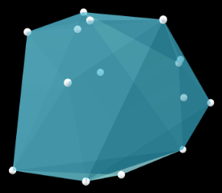
    
    - Dodecahedron：正十二面体（五种柏拉图立体之一，由12个正五边形面组成的正多面体）

        
    
    - Icosahedron：正二十面体（五种柏拉图立体之一，由20个正三角形面组成的正多面体）

        
    
    - Octahedron：正八面体（五种柏拉图立体之一，由8个正三角形面组成的正多面体）

        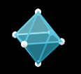
    
    - Polyhedron：多面体抽象基类（定义多面体的核心特性，是各类具体多面体的父类）

        
    
    - Tetrahedron：正四面体（五种柏拉图立体之一，由4个正三角形面组成的正多面体）

        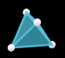

- three_d_utils：三维对象（mobjects）的工具函数集合（提供三维场景相关的辅助功能，如坐标转换、视角调整等）

- three_dimensions：三维对象集合（mobjects）（包含各类三维可视化核心对象，如三维几何体、三维坐标轴等）

    - Arrow3D：由圆柱形线条和圆锥形箭头组成的三维箭头（适配三维场景的指向性标注）

        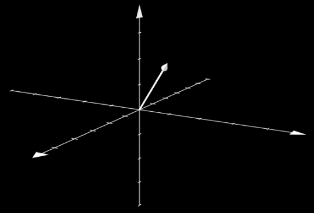
    
    - Cone：圆锥体（圆形底面的三维锥体，支持自定义底面半径、高度等参数）

        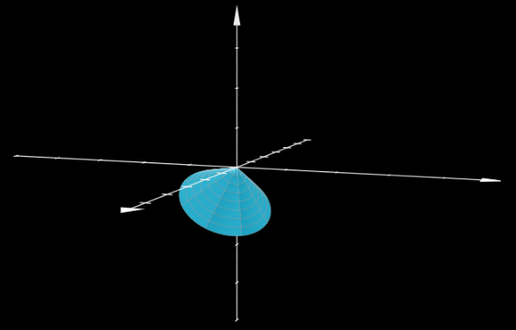
    
    - Cube：三维立方体（正六面体，所有面为正方形，可自定义边长）

        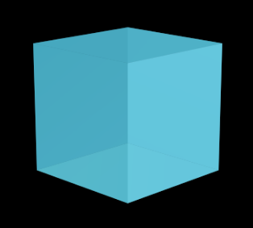
    
    - Cylinder：圆柱体（由高度、半径和方向定义的三维柱体，默认轴线沿特定方向）

        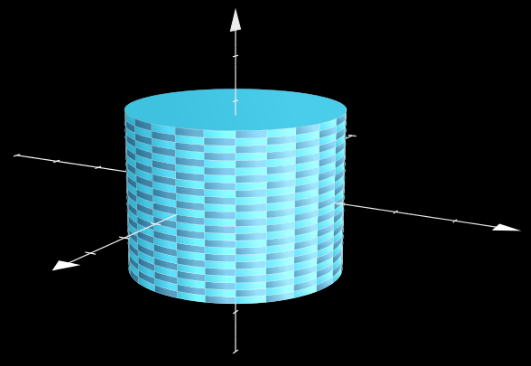
    
    - Dot3D：球形点（三维场景中的点对象，呈现为球体，适配三维空间标记）

        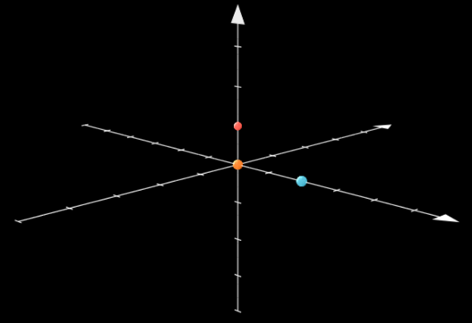

    - Line3D：圆柱形线条（专门用于 ThreeDScene 的三维线段，支持三维空间两点连线）

        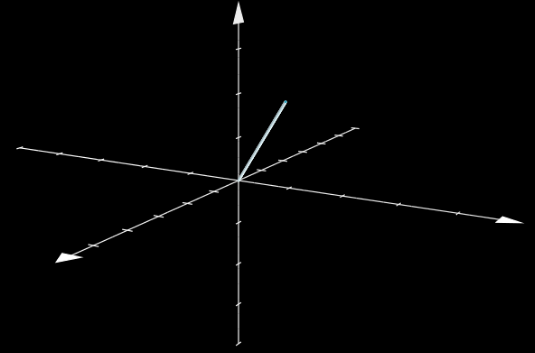

    - Prism：正长方体（直平行六面体，即长方体，所有面为矩形，可自定义长宽高）

        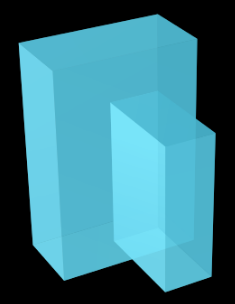
    
    - Sphere：三维球体（完整球形三维几何体，支持自定义半径）

        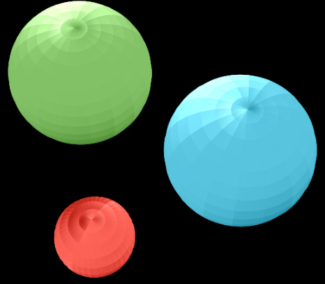

    - Surface：使用棋盘格图案创建的参数化曲面（基于参数方程生成的三维曲面，自带棋盘格纹理）

        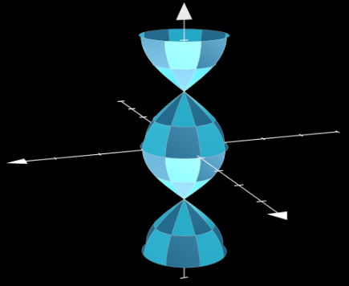
    
    - ThreeDVMobject：三维矢量对象基类（所有三维矢量对象的父类，定义三维对象的核心特性）
    
    - Torus：圆环体（甜甜圈状三维几何体，由圆环绕轴线旋转形成，支持自定义内半径、外半径）

        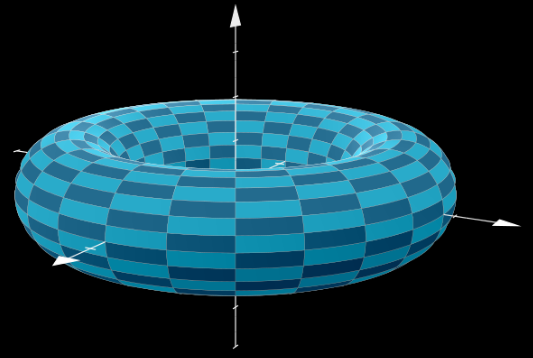

