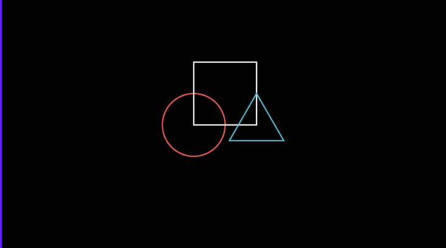
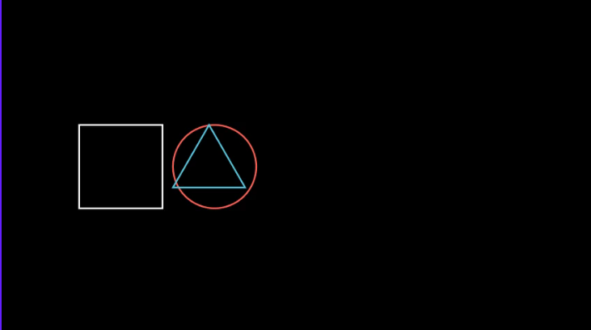

# 动画(animation)

将Mobject的方法放入`play()`方法中才产生动画, 否则只渲染结果

## 常用方法


### 位置相关的方法

方法|描述
--|--
`shift()`|相对之前的位置移动
`move_to()`|相对于ORIGIN(0,0)点, 绝对位置移动
`next_to()`|放在其他mobject的旁边, 第一个参数对象, 第二个参数是方位(UP,DOWN,LEFT,RIGHT)
`align_to()`|和其他的mobject对齐
`set_xyz()`|设置坐标
`to_edge()`|到屏幕边缘
`set_z_index()`|设置上下关系


```python
# 使用shift进行相对位置变换, 默认所有图像都在scene中心, 使用shift进行相对的位置的移动
from manim import *

class Shapes(Scene):
    def construct(self):
        circle = Circle()
        square = Square()
        triangle = Triangle()

        circle.shift(LEFT)
        square.shift(UP)
        triangle.shift(RIGHT)

        self.add(circle, square, triangle)
        self.wait(1)
```


```python
# 使用`**_to`方法改变两个对象的相对位置
from manim import *
class MobjectPlacement(Scene):
    def construct(self):
        circle = Circle()
        square = Square()
        triangle = Triangle()

        # place the circle two units left from the origin
        circle.move_to(LEFT * 2)
        # place the square to the left of the circle
        square.next_to(circle, LEFT)
        # align the left border of the triangle to the left border of the circle
        triangle.align_to(circle, LEFT)

        self.add(circle, square, triangle)
        self.wait(1)
```


## 风格相关方法

方法|描述
--|--
`set_stroke()`|设置边 适用于vmobject
`set_fill()`|静态填充 适用于vmobject
`set_color()`| 适用于mobject
`rotate()`|静态旋转
`scale()`|方法和缩小倍数


```python
from manim import *

class MobjectStyling(Scene):
    def construct(self):
        circle = Circle().shift(LEFT)
        square = Square().shift(UP)
        triangle = Triangle().shift(RIGHT)

        circle.set_stroke(color=GREEN, width=20)
        square.set_fill(YELLOW, opacity=1.0)
        triangle.set_fill(PINK, opacity=0.5)

        self.add(circle, square, triangle)
        self.wait(1)
```


### 其他方法

方法|描述
--|--
`copy()`|复制
`flip()`|转换和复制
`get_bottom()`|返回mobject的bottom坐标
`get_center()`|获得中心点
`get_color()`|获得颜色
`get_coord()`|get_x, get_y and get_z的组合
`get_corner()`| corner coordinates
`get_end()`|
`get_left()`|
`get_midpoint()`|
`get_right()`|
`get_start()`|
`get_top()`|
`match_*()`|复制另一个mobject的相关属性
`restore()`|获得之前通过`save_state()`保存的状态
`save_state()`|
`save_image()`|保存mobject的图片


## 动画


要将animation对象放入`self.play()`中使用


### 全局的动画
方法|描述
--|--
`Create()`|创建一个mobject
`Transform()`|将两个mobject进行转换
`ReplacementTransform`(square, circle)|
`FadeOut()`|淡出
`FadeIn()`|淡入

```python
from manim import *

class SomeAnimations(Scene):
    def construct(self):
        square = Square()
        # some animations display mobjects, ...
        self.play(FadeIn(square))
        # some animations remove mobjects from the screen
        self.play(FadeOut(square))
```


分类|对象|描述
--|--|--
animation|[Animation](https://docs.manim.community/en/stable/reference/manim.animation.animation.Animation.html)|由各个mobject重写, 不需要我们直接使用
animation|[Wait](https://docs.manim.community/en/stable/reference/manim.animation.animation.Wait.html)|没有操作的动画(静止的动画), 由`scene`调用
changing|[TracedPath](https://docs.manim.community/en/stable/reference/manim.animation.changing.TracedPath.html)|跟踪轨迹
creation|[Create](https://docs.manim.community/en/stable/reference/manim.animation.creation.Create.htmlL)|创建图像
creation|[Uncreate](https://docs.manim.community/en/stable/reference/manim.animation.creation.Uncreate.html#manim.animation.creation.Uncreate)|create的逆
creation|[Write](https://docs.manim.community/en/stable/reference/manim.animation.creation.Write.html#manim.animation.creation.Write)|文字书写
creation|[Unwrite](https://docs.manim.community/en/stable/reference/manim.animation.creation.Unwrite.html#manim.animation.creation.Unwrite)|write逆
fading|[FadeIn](https://docs.manim.community/en/stable/reference/manim.animation.fading.FadeIn.html)|渐入
fading|[FadeOut](https://docs.manim.community/en/stable/reference/manim.animation.fading.FadeOut.html)|渐出
growing|[GrowArrow](https://docs.manim.community/en/stable/reference/manim.animation.growing.GrowArrow.html)|生长
indication|[Flash](https://docs.manim.community/en/stable/reference/manim.animation.indication.Flash.html)|小烟花
movement|[MoveAlongPath](https://docs.manim.community/en/stable/reference/manim.animation.movement.MoveAlongPath.html)|按照路径移动
numbers|
rotation|[Rotate](https://docs.manim.community/en/stable/reference/manim.animation.rotation.Rotate.html)|旋转
specialized|[Broadcast](https://docs.manim.community/en/stable/reference/manim.animation.specialized.Broadcast.html)|广播
speedmodifier|[ChangeSpeed](https://docs.manim.community/en/stable/reference/manim.animation.speedmodifier.ChangeSpeed.html)|速度控制
transform|[ApplyMatrix](https://docs.manim.community/en/stable/reference/manim.animation.transform.ApplyMatrix.html#manim.animation.transform.ApplyMatrix)|矩阵转换
transform_matching_parts|[TransformMatchingShapes](https://docs.manim.community/en/stable/reference/manim.animation.transform_matching_parts.TransformMatchingShapes.html)|仅仅转换字符串不同部分
updaters||


### mobject本身的animate

`square.set_fill(WHITE)`直接设置`square`的颜色, `square.animate.set_fill(WHITE)`则会将设置颜色的过程形成动画.

`mobject.animate`可以放入`scene.play()`方法中, 来形成动画

```python
from manim import *

class AnimateExample(Scene):
    def construct(self):
        square = Square().set_fill(RED, opacity=1.0)
        self.add(square)
        # animate the change of color
        self.play(square.animate.set_fill(WHITE))
        # animate the change of position and the rotation at the same time
        self.play(square.animate.shift(UP).rotate(PI / 3))

```


## 参考:
- https://docs.manim.community/en/stable/tutorials/quickstart.html
- https://www.zhihu.com/column/c_1385733360715632640