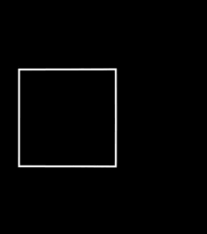
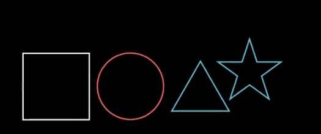
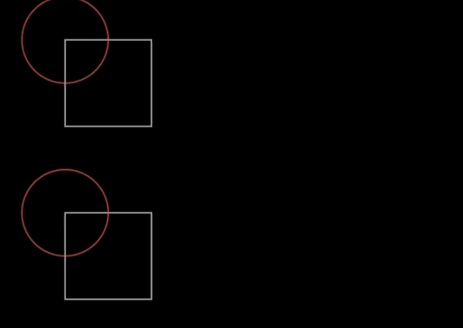
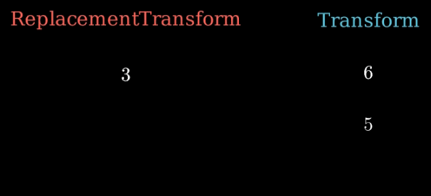

# [transform](https://docs.manim.community/en/stable/reference/manim.animation.transform.html)


- ApplyComplexFunction：对对象（Mobject）应用复函数变换
- ApplyFunction：对对象（Mobject）应用自定义函数变换


- ApplyMethod：通过调用对象（Mobject）的方法来实现动画效果✨基础类, 不直接使用
- ApplyPointwiseFunction：对对象（Mobject）的每个点逐点应用函数变换

    

    ```python
    square = Square()
    self.play(
        ApplyPointwiseFunction(
            lambda point: complex_to_R3(np.exp(R3_to_complex(point))), square
        )
    )
    ```


- ApplyMatrix：对对象（Mobject）应用矩阵变换

    


    ```python
    matrix = [[1, 1], [0, 2/3]]
    self.play(ApplyMatrix(matrix, Text("Hello World!")), ApplyMatrix(matrix, NumberPlane()))
    ```

- ApplyPointwiseFunctionToCenter：对对象（Mobject）的中心逐点应用函数变换
- ClockwiseTransform：让对象（Mobject）的所有点沿顺时针方向的弧线进行变换

    


    ```python
    dl, dr = Dot(), Dot()
    sl, sr = Square(), Square()

    VGroup(dl, sl).arrange(DOWN).shift(2*LEFT)
    VGroup(dr, sr).arrange(DOWN).shift(2*RIGHT)

    self.add(dl, dr)
    self.wait()
    self.play(
        ClockwiseTransform(dl, sl),
        Transform(dr, sr)
    )
    ```

- CounterclockwiseTransform：让对象（Mobject）的所有点沿逆时针方向的弧线进行变换
- CyclicReplace：使多个对象（Mobjects）按循环顺序移动替换（如 A→B 位置、B→C 位置、C→A 位置）

    


- FadeToColor：改变对象（Mobject）的颜色（渐变过渡）

    

- FadeTransform：将一个对象（Mobject）淡入过渡为另一个对象

    


- FadeTransformPieces：将一个对象的子对象（submobjects）分别淡入过渡为另一个对象的对应子对象

    

- MoveToTarget：将对象（Mobject）变换到其自身 `target` 属性中存储的目标对象状态

    

- ReplacementTransform：将一个对象（Mobject）替换并变形为目标对象

    


- Restore：将对象（Mobject）变换回其最后保存的状态

    


- ScaleInPlace：按指定比例对对象（Mobject）进行原位缩放（不改变位置）

    

- ShrinkToCenter：让对象（Mobject）向自身中心收缩

    

- Swap：交换两个对象（Mobjects）的位置或状态
- Transform：将一个对象（Mobject）变换为目标对象（核心变换类动画）

    

- TransformAnimations：变换类动画的集合/抽象类（用于管理多个变换动画）
- TransformFromCopy：以反向变换的方式执行——保留原对象，复制一份并变换为目标对象（与普通 Transform不同，原对象不消失）
