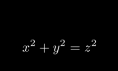

# [transform_matching_parts](https://docs.manim.community/en/stable/reference/manim.animation.transform_matching_parts.html)

- TransformMatchingAbstractBase：跟踪匹配部分的变换抽象基类（用于定义具有“匹配逻辑”的变换动画的基础类）

    ✨基础类, 不直接使用

- TransformMatchingShapes：通过匹配子对象（submobjects）的形状来变换对象组的动画

    

- TransformMatchingTex：用于变换渲染后的 LaTeX 字符串的变换动画（核心是匹配 Tex 元素的对应部分进行平滑过渡）

    

