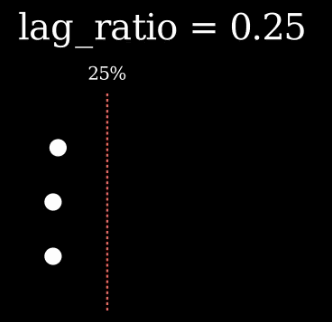
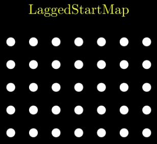

# composition

1. AnimationGroup：播放一组或一系列动画. 

    ✨基础类不直接使用.

2. LaggedStart：根据延迟比例（lag_ratio）调整一系列动画的时序

    

3. LaggedStartMap：播放一系列动画，同时将函数映射到子对象（submobjects）

    

4. Succession：连续播放一系列动画

    

