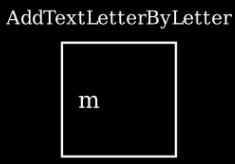
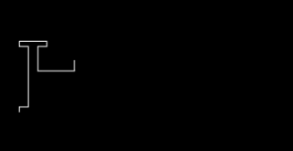

# creation

- 基础类
    - ShowIncreasingSubsets：每次显示一个子对象（submobject），保留之前所有显示的内容在屏幕上.

        ✨基础类, 不直接使用

    - ShowSubmobjectsOneByOne：每次显示一个子对象（submobject），移除之前所有显示在屏幕上的内容

        ✨基础类, 不直接使用

    - ShowPartial：用于部分显示矢量对象（VMobject）的抽象动画类

        ✨基础类, 不直接使用

- 文字类

    - AddTextLetterByLetter：在场景中逐字母显示文本（Text）

        

    - RemoveTextLetterByLetter：从场景中逐字母移除文本（Text）

    - AddTextWordByWord：在场景中逐单词显示文本（Text）

    - TypeWithCursor：与 AddTextLetterByLetter 类似，但在末尾添加光标对象（cursor mobject）

        

    - UntypeWithCursor：与 RemoveTextLetterByLetter 类似，但在末尾添加光标对象（cursor mobject）

    - Unwrite：模拟用手擦除文本（Text）或矢量对象（VMobject）的效果
    - Write：模拟手写文本（Text）或手绘矢量对象（VMobject）的效果

        

- 通用类

    - Create：逐步显示一个矢量对象（VMobject）

        

    - Uncreate：与 Create 功能相反（反向逐步隐藏矢量对象）

    - DrawBorderThenFill：先绘制边界，再显示填充内容

        

    - SpiralIn：子对象（sub-Mobjects）沿螺旋轨迹飞入，生成目标对象（Mobject）

        

