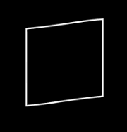

# movement

- ComplexHomotopy：复同伦，是从复平面与区间[0,1]的乘积空间（ℂ×[0,1]）映射到复平面（ℂ）的函数
- Homotopy：同伦（基础同伦类动画）

    

- MoveAlongPath：让一个对象（Mobject）沿着另一个对象（Mobject）的路径移动

    

- PhaseFlow：相流（基于向量场的平滑运动动画）
- SmoothedVectorizedHomotopy：平滑矢量化同伦（优化后的矢量化同伦动画）

