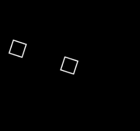

# [rotate](https://docs.manim.community/en/stable/reference/manim.animation.rotation.Rotate.html)




```python
self.play(
    Rotate(
        Square(side_length=0.5).shift(UP * 2),
        angle=2*PI,
        about_point=ORIGIN,
        rate_func=linear,
    ),
    Rotate(Square(side_length=0.5), angle=2*PI, rate_func=linear),
    )
```