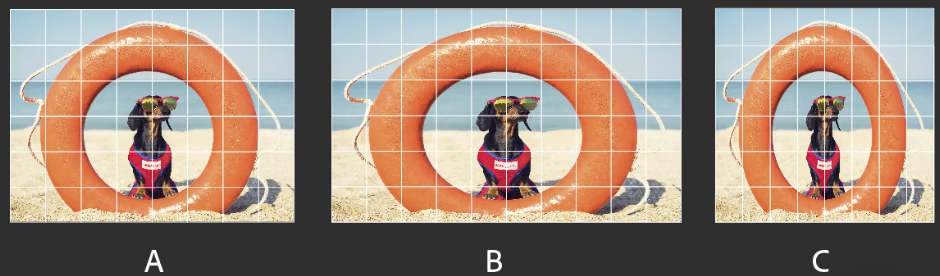

像素长宽比用于描述单一像素的宽度与高度的比例。像素长宽比会变化，因为不同视频系统对填充一帧所需的像素数量设定不同。

例如，许多计算机视频标准将 4:3 长宽比帧定义为 640 像素宽 x 480 像素高，这将产生方形像素。 此计算机视频像素的像素长宽比为 1:1（方形）。

DV NTSC 等视频标准将 4:3 长宽比帧定义为 720x480 像素，这会产生较窄的矩形像素。DV NTSC 像素的像素长宽比为 0.91（非正方形）。DV 像素（总是为矩形）在生成 NTSC 视频的系统中采用垂直方向，而在生成 PAL 视频的系统中采用水平方向。

- A. 在 4:3 方形像素（计算机）显示器上显示的 4:3 方形像素图像 
- B. 在 4:3 非方形像素（电视）显示器上显示且解释正确的 4:3 方形像素图像 
- C. 在 4:3 非方形像素（电视）显示器上显示但解释错误的 4:3 方形像素图像  

