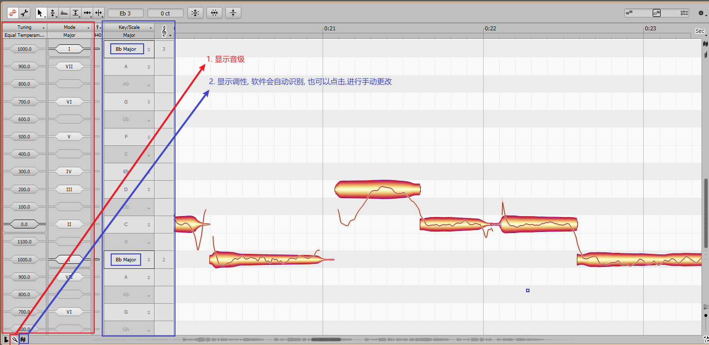
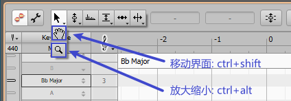
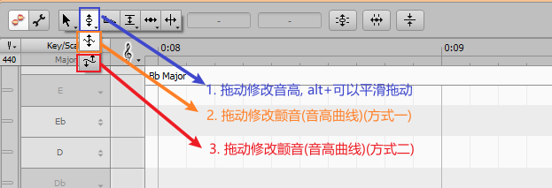
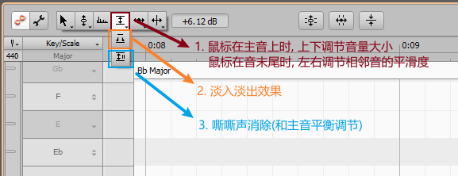
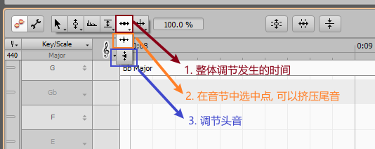
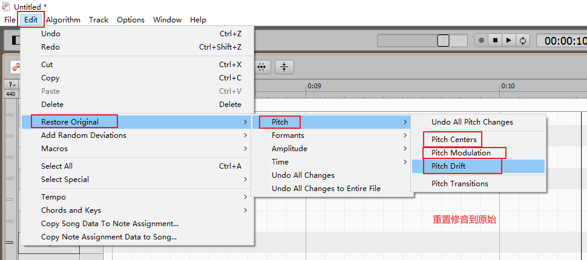
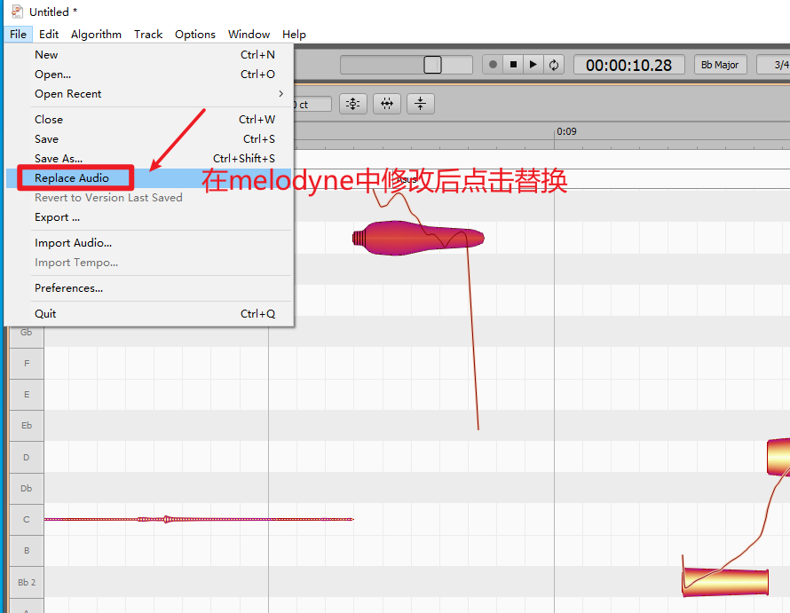

# melodyne

melodyne, 是用来修音的软件, 主页面分为四个部分:
1. 音轨/音符细节
2. 多音轨
3. 单音轨编辑
4. 均衡器(用的较少)

## 音符属性
在音符细节中, 可以看到音符的各个属性, 并且可以直接输入或鼠标上下拖动调节

## 调性与和弦
在单音轨编辑左下角, 可以调出音级和调性的显示

在单音轨编辑右上角, 可以调出时间线上对应的调性和和弦. 可以自己手动输入

也可以让软件根据人声,自动识别

## 工具栏
### 拖拽和移动
工具栏第一个: 拖拽和移动:

### 音高调节
工具栏第二个: 音高调节

另外, 还可以自动调节

### 标准化调节
工具栏第三个: 标准化调节(整体相对调节)

### 音量调节
工具栏第四个: 音量调节

另外还可以进行自动的音量调节:

### 时值调节
工具栏第五个: 时值调节:

另外还可以自动调节

### 撤销与还原

## 与auditon协同
1. 在audition多轨中, 录制声音

2. 在文件夹中获得源文件, 并载入到melodyne中

3. 在 melodyne中编辑并替换
